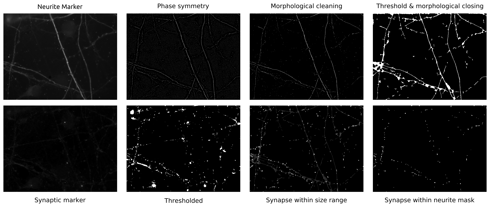

# neuronab

A python module that automatically isolates neurites and potential synapses
on immunofluorescence images.

## Examples

``` python
import matplotlib.pyplot as plt
from neuronab import main as neuronab

# there are several ways to interact with the subroutines:
# a) you can provide the path to the appropriate image
neurite_marker = "/path/to/neurite/marker/image.jpg"
neurite_mask = neuronab.neurites.isolate(neurite_marker)

# b) you can provide a raw image loaded as a numpy array
neurite_marker = plt.imread("/path/to/neurite/marker/image.jpg")
neurite_mask = neuronab.neurites.isolate(neurite_marker)

synaptic_marker = plt.imread("/path/to/synapse/marker/image.jpg")
synapse_mask = neuronab.synapses.isolate(synaptic_marker, neurite_mask,
                                         min_synapse_size=16, # in pixel
                                         max_synapse_size=144, # in pixel
                                         min_synapse_brightness=97.5, # in %
                                         )

# you can compute properties of the isolated structures
neurite_length = neuronab.neurites.get_length(neurite_mask) # in pixels
synapse_count = neuronab.synapses.get_count(neurite_marker, synapse_marker) % in number of isolated objects

# bulk processing of images is facilitated via a Excel/CSV spreadsheet interface;
# arguments/returns corresponds to existing columns in the spreadsheet
spreadsheet_path = "/path/to/spreadsheet.xls"
neuronab.spreadsheet_io.apply_and_append(
    spreadsheet_path,
    func=neuronab.synapses.count,
    arguments=['neurite_marker',
               'primary_synaptic_marker',
               'secondary_synaptic_marker',
               'min_synapse_size',
               'max_synapse_size',
               'min_synapse_brightness',
               'show',
               'save'],
    returns=['neurite_length',
             'primary_count',
             'secondary_count',
             'dual_labelled']
)

# of the provided spreadsheet template is used, convenience functions can be used instead:
neuronab.count_synapses(spreadsheet_path)

```


